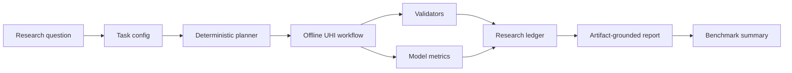

# GeoSciLoop

GeoSciLoop is a reproducibility-first starter repo for remote-sensing/GIS AI-scientist workflows, with v0.1 focused on a deterministic offline Urban Heat Island demo.

GeoSciLoop v0.1 demonstrates the loop shape:

```text
research question -> structured task -> research plan -> synthetic data manifest
-> UHI analysis -> validators -> model results -> ledger -> report -> benchmark
```

It does not perform full autonomous scientific discovery, call live LLMs, require Google Earth Engine authentication, download large datasets, or make real-world UHI claims.

## Quickstart

```powershell
python -m pip install -e ".[dev]"
pytest -q
geosciloop run configs/uhi_synthetic_demo.yaml --offline
```

## Example Output

```text
outputs/uhi_synthetic_demo/
|-- data_manifest.json
|-- research_plan.yaml
|-- research_ledger.json
|-- validation_report.json
|-- metrics.json
|-- tables/
|   |-- synthetic_uhi_data.csv
|   `-- model_predictions.csv
|-- figures/
|   |-- lst_distribution.png
|   |-- ndvi_vs_lst.png
|   |-- predicted_vs_observed.png
|   `-- feature_importance.png
|-- report.md
`-- run_log.json
```

## Architecture



The scientific reliability surface is deterministic validators plus a machine-readable research ledger. Agent runtimes, GEE/STAC adapters, and citation checking are deferred until the offline v0.1 loop is reliable.

## References

See `docs/reference_map.md` for the inspected references and what GeoSciLoop borrows conceptually. No source code from those repositories is copied into v0.1.

## Roadmap

- v0.1: deterministic synthetic UHI workflow, validators, ledger, report, tests.
- v0.2: optional real-data adapters for STAC, GEE, OSM, GHSL, and WorldPop.
- v0.3: explicit state-machine or LangGraph-style runtime after validation surfaces exist.
- v0.4: GeoSciBench-style benchmark tasks.
- v0.5: citation checking and human-in-the-loop scientific review.
